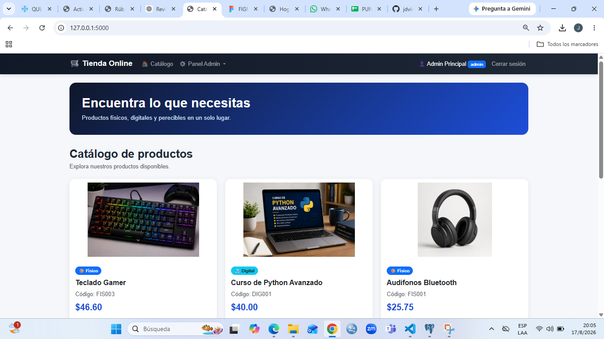
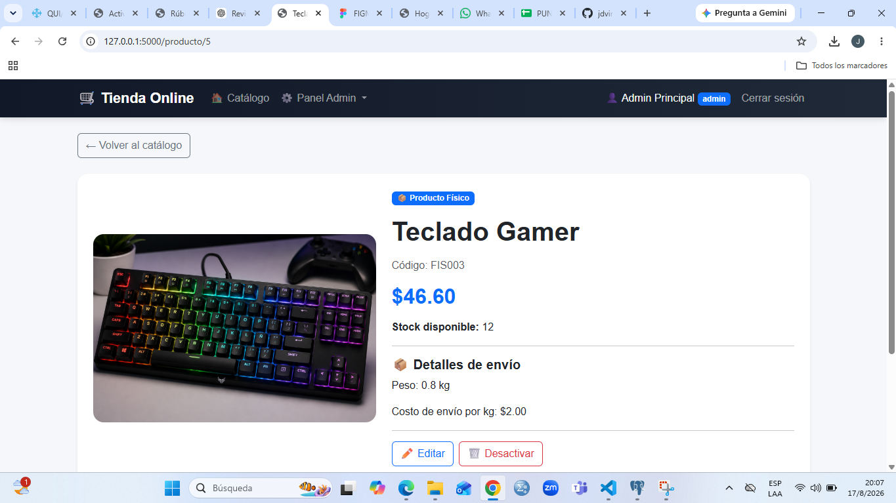
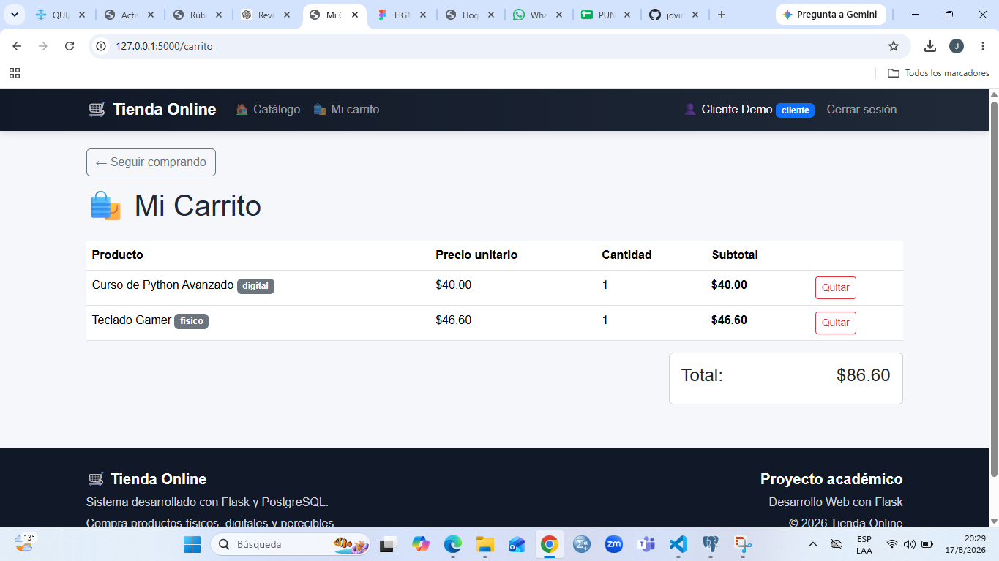

# Tienda Online - Flask + PostgreSQL

## Descripción

Proyecto académico desarrollado con Flask y PostgreSQL.

La aplicación permite gestionar una tienda online con productos físicos, digitales y perecibles. Incluye sistema de usuarios, inicio de sesión, roles, permisos, carrito de compras, gestión de productos, subida de imágenes y un diseño responsive mejorado.

El proyecto fue desarrollado siguiendo las actividades de las Semanas 1, 2 y 3, además de las mejoras adicionales de imágenes y diseño.

---

## Funcionalidades

- Registro de usuarios.
- Inicio y cierre de sesión.
- Contraseñas almacenadas de forma segura mediante hash.
- Roles de usuario:
  - Administrador.
  - Cliente.
- Control de permisos.
- Creación de productos físicos.
- Creación de productos digitales.
- Creación de productos perecibles.
- Edición de productos.
- Desactivación de productos.
- Catálogo de productos.
- Vista de detalle de cada producto.
- Carrito de compras.
- Agregar productos al carrito.
- Quitar productos del carrito.
- Manejo de cantidades.
- Cálculo automático de subtotal y total.
- Subida de imágenes de productos.
- Cambio de imágenes desde la edición.
- Diseño responsive con Bootstrap.
- Estilos personalizados con CSS.

---

## Tecnologías utilizadas

- Python
- Flask
- Flask-SQLAlchemy
- PostgreSQL
- pgAdmin
- HTML
- CSS
- Bootstrap
- Werkzeug
- Git
- GitHub

---

## Estructura del proyecto

```text
tienda_online/
│
├── static/
│   ├── css/
│   │   └── style.css
│   │
│   ├── uploads/
│   │   └── imágenes de productos
│   │
│   └── capturas/
│       ├── catalogo.png
│       ├── detalle.png
│       └── carrito.png
│
├── templates/
│   ├── base.html
│   ├── carrito.html
│   ├── detalle.html
│   ├── editar.html
│   ├── index.html
│   ├── login.html
│   ├── nuevo_digital.html
│   ├── nuevo_fisico.html
│   ├── nuevo_perecible.html
│   └── registro.html
│
├── app.py
├── auth.py
├── config.py
├── init_db.py
├── models.py
├── requirements.txt
├── .gitignore
└── README.md
```

---

## Instalación

### 1. Clonar el repositorio

```bash
git clone https://github.com/jdvinicio97-max/tienda_online.git
```

Entrar a la carpeta:

```bash
cd tienda_online
```

### 2. Crear el entorno virtual

```bash
python -m venv venv
```

En Windows PowerShell:

```powershell
Set-ExecutionPolicy -Scope Process -ExecutionPolicy Bypass
```

Activar el entorno virtual:

```powershell
.\venv\Scripts\Activate.ps1
```

### 3. Instalar las dependencias

```bash
pip install -r requirements.txt
```

---

## Configuración de PostgreSQL

Crear una base de datos llamada:

```text
tienda_online
```

Luego crear un archivo `.env` en la carpeta principal del proyecto.

Ejemplo:

```env
DB_USER=postgres
DB_PASSWORD=TU_CONTRASEÑA
DB_HOST=localhost
DB_PORT=5432
DB_NAME=tienda_online
SECRET_KEY=tu_clave_secreta
```

El archivo `.env` no se incluye en GitHub por seguridad.

---

## Crear las tablas y datos de prueba

Ejecutar:

```bash
python init_db.py
```

Este comando crea las tablas de la base de datos y agrega usuarios y productos de prueba.

---

## Ejecutar la aplicación

Con el entorno virtual activado:

```bash
python app.py
```

Después abrir en el navegador:

```text
http://127.0.0.1:5000
```

---

## Credenciales de prueba

### Administrador

```text
Correo: admin@tienda.com
Contraseña: admin123
```

El administrador puede:

- Acceder al Panel Admin.
- Crear productos.
- Editar productos.
- Desactivar productos.
- Subir imágenes.
- Cambiar imágenes de productos.

### Cliente

```text
Correo: cliente@tienda.com
Contraseña: cliente123
```

El cliente puede:

- Consultar el catálogo.
- Ver el detalle de productos.
- Agregar productos al carrito.
- Quitar productos del carrito.
- Consultar cantidades, subtotales y total.

---

## Tipos de productos

### Producto físico

El precio final incluye el costo de envío calculado según el peso del producto y el costo de envío por kilogramo.

### Producto digital

El precio puede variar según el tipo de licencia seleccionada.

### Producto perecible

El precio puede aplicar descuentos dependiendo de los días restantes antes del vencimiento.

---

## Subida de imágenes

Se agregó soporte para imágenes de productos.

Los formularios permiten subir archivos en los siguientes formatos:

```text
.png
.jpg
.jpeg
.webp
```

Las imágenes son procesadas en Flask utilizando:

- `request.files`
- `secure_filename`
- `uuid4`

Los archivos se almacenan en:

```text
static/uploads/
```

En PostgreSQL se guarda el nombre del archivo en la columna:

```text
imagen
```

Los productos que no tienen una imagen cargada muestran una alternativa visual.

---

## Mejoras de diseño

La interfaz fue mejorada utilizando Bootstrap y CSS personalizado.

Entre las mejoras realizadas se encuentran:

- Barra de navegación responsive.
- Identidad visual en tonos azul y oscuro.
- Hero principal en el catálogo.
- Tarjetas de productos con sombras.
- Efectos hover.
- Imágenes uniformes.
- Diferenciación visual entre productos físicos, digitales y perecibles.
- Mejor espaciado y presentación.
- Footer.
- Alertas visuales para mensajes de éxito y error.
- Adaptación para dispositivos móviles.

---

## Capturas de pantalla

### Catálogo

Vista principal del catálogo con el diseño mejorado, imágenes de productos y acceso al Panel Admin.



---

### Detalle de producto

Vista del detalle de un producto con imagen, precio, stock, información adicional y opciones de administración.



---

### Carrito de compras

Vista del carrito desde una cuenta con rol cliente. Se muestran los productos agregados, precio unitario, cantidad, subtotal y total.



---

## Seguridad

El proyecto utiliza un archivo `.gitignore` para evitar subir información privada o archivos innecesarios.

Contenido principal:

```text
venv/
__pycache__/
.env
*.pyc
```

Esto evita publicar:

- El entorno virtual.
- Archivos temporales de Python.
- Credenciales de PostgreSQL.
- La clave secreta de Flask.

---

## Base de datos

La aplicación utiliza PostgreSQL junto con Flask-SQLAlchemy.

Las principales tablas son:

```text
usuarios
productos
```

La tabla `usuarios` almacena la información de los usuarios, sus roles y las contraseñas protegidas mediante hash.

La tabla `productos` almacena los productos físicos, digitales y perecibles, sus características y el nombre de la imagen asociada.

---

## Roles y permisos

### Administrador

Las rutas administrativas están protegidas mediante:

```python
@rol_requerido("admin")
```

El administrador tiene permisos para gestionar el catálogo.

### Cliente

Las rutas que requieren una sesión activa utilizan:

```python
@login_requerido
```

El cliente puede utilizar el carrito de compras y consultar los productos.

---

## Carrito de compras

El carrito permite:

- Agregar productos.
- Incrementar cantidades.
- Quitar productos.
- Calcular subtotales.
- Calcular el total de la compra.

El carrito se administra mediante la sesión de Flask.

---

## Mejoras adicionales realizadas

Además de las funcionalidades de las Semanas 1, 2 y 3, se implementaron dos mejoras adicionales.

### A. Imágenes de productos

- Se agregó la columna `imagen` al modelo `Producto`.
- Se permiten archivos `.png`, `.jpg`, `.jpeg` y `.webp`.
- Las imágenes se reciben utilizando `request.files`.
- Se utiliza `secure_filename`.
- Se genera un nombre único utilizando `uuid4`.
- Las imágenes se guardan en `static/uploads/`.
- Las imágenes se muestran en el catálogo.
- Las imágenes se muestran en el detalle del producto.
- Se puede cambiar la imagen desde la edición.
- Los productos sin imagen muestran una alternativa visual.

### B. Mejora de diseño

- Se agregó CSS personalizado.
- Se mejoró la barra de navegación.
- Se mejoraron las tarjetas de productos.
- Se agregó un hero principal.
- Se agregaron efectos visuales.
- Se mejoró la presentación de imágenes.
- Se agregó un footer.
- Se mejoraron los mensajes de éxito y error.
- La aplicación se adapta a distintos tamaños de pantalla.

---

## Autor

Proyecto académico desarrollado para la actividad:

**Proyecto Tienda Online - Flask + PostgreSQL**

Desarrollado como parte de las actividades de las Semanas 1, 2 y 3, junto con las mejoras adicionales de imágenes y diseño.
